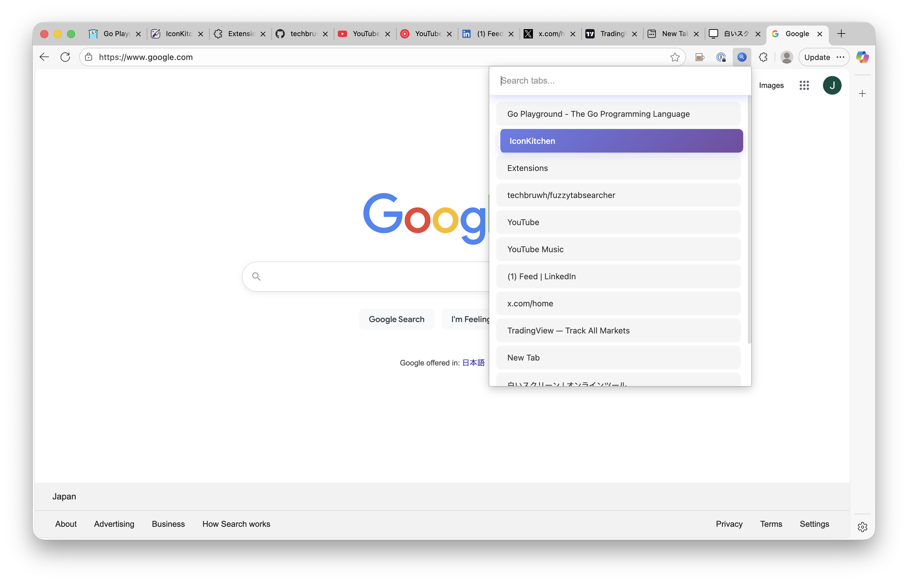

# fuzzytabsearcher

Search through all open tabs quickly with a keyboard shortcut. Find any open tab instantly without manually switching through windows.



*Screenshot: fuzzytabsearcher popup in action*


## Features

-  **Quick Search**: Filter tabs by title or URL as you type
-  **Keyboard Navigation**: Use arrow keys (Up/Down) to navigate results
-  **Instant Switching**: Press Enter or click to switch to any tab
-  **Modern UI**: Beautiful, responsive interface
-  **Privacy First**: All searching happens locally in your browser

## Installation

### Option 1: Load from GitHub (Development)

1. Clone the repository:
   ```bash
   git clone https://github.com/techbruwh/fuzzytabsearcher.git
   cd fuzzytabsearcher
   ```

2. Open Chrome and navigate to:
   ```
   chrome://extensions/
   ```

3. Enable "Developer mode" (toggle in the top right corner)

4. Click "Load unpacked" and select the `fuzzytabsearcher` folder from your cloned repository

5. The extension will now appear in your Chrome toolbar

### Option 2: Install from Chrome Web Store

(Coming soon - extension is being prepared for Chrome Web Store submission)

## Usage

1. Click the extension icon in your Chrome toolbar, or use the keyboard shortcut:
   - **Mac**: `Command + Shift + K`
   - **Windows/Linux**: `Ctrl + Shift + K`

2. Start typing to search through your open tabs

3. Navigate results:
   - Use **Up/Down Arrow Keys** to navigate
   - Press **Enter** to switch to the selected tab
   - Or click on any tab to switch to it

## How It Works

When you open the Tab Searcher popup, it displays all your currently open tabs. As you type in the search box, the list filters in real-time to show matching tabs based on their title or URL.

## Keyboard Shortcuts

| Action | Mac | Windows/Linux |
|--------|-----|---------------|
| Open Tab Searcher | `Command + Shift + K` | `Ctrl + Shift + K` |
| Navigate Down | `Arrow Down` | `Arrow Down` |
| Navigate Up | `Arrow Up` | `Arrow Up` |
| Switch to Tab | `Enter` | `Enter` |
| Search | Type normally | Type normally |

## Privacy Policy

This extension:
- Only accesses tab information when the extension is actively used
- Does not collect or transmit any personal data
- Does not use cookies or tracking
- All tab searching happens locally within your browser
- No external API calls are made

## Development

### Project Structure

```
fuzzytabsearcher/
├── manifest.json      # Extension configuration
├── popup.html         # Popup interface
├── popup.js           # Search functionality
├── popup.css          # Styling
├── background.js      # Service worker
├── LICENSE            # MIT License
└── readme.md          # This file
```

### Technologies Used

- Vanilla JavaScript (no frameworks)
- CSS3 with modern features
- Chrome Extension API v3

## Contributing

Contributions are welcome! Please feel free to submit issues or pull requests.

## License

This project is licensed under the MIT License - see the [LICENSE](LICENSE) file for details.

## Support

If you encounter any issues:
1. Check that "Developer mode" is enabled in `chrome://extensions/`
2. Try reloading the extension
3. Clear your search box and try again
4. Open an issue on GitHub with details about the problem